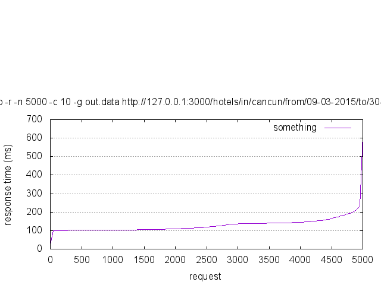
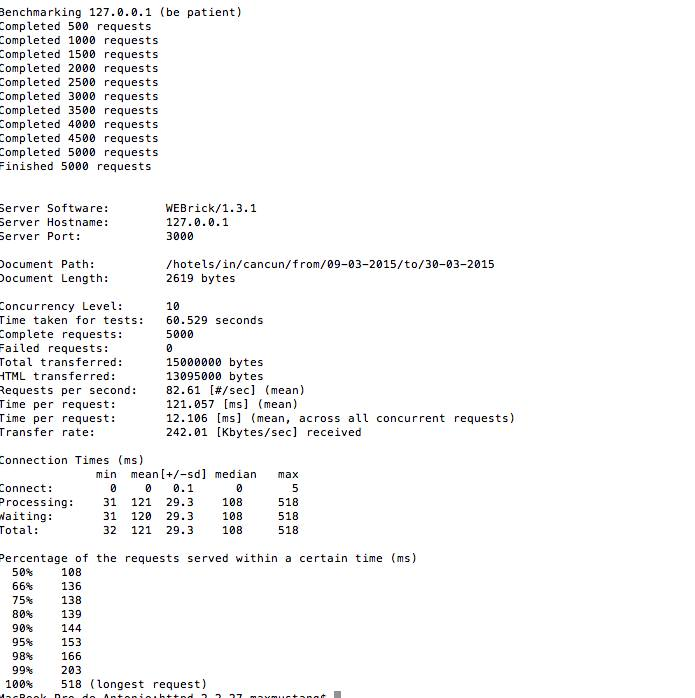

#Hotel_urbano

#versão Ruby and Rails 
	Este projeto utiliza o na versão 1.9.3 e rails na 3.2.21

#rodando
	é necessário dar necessário autorização ao arquivo configure.sh e depois roda-lo
		chmod +x ./configure
		./configure
	após isso, basta chamar o make
		make
	o make rodara o hotel_urbano_development automaticamente na porta 3000
		localhost:3000/
	caso queria rodar apos o make
		rails s

#Hotels
	Foram criadas cerca de 10 hoteis em duas cidades diferentes: Rio de Janeiro e Cancun

#Periods
	Foram adicionados periodos de estadias ao hoteis baseados nas seguintes regras
		1) Um periodo não pode sobreescrever o outro
			entrada 10/3 - saida 14/4
			Nao posso ter um periodo que sobrevesva outro ja esxistente, por exemplo: 12/3 - 17/3 ou 08/03 - 12/03
		3) As datas dos periodos devem seguir uma linha reta
			10/3 - 15/3, 16/3 - 20/3, 05/3 - 09/03
		4) Um hotel pode ter quantos periodos quiser

#Database
	hotel_urbano utiliza o mongodb como database principal

#test
	os testes unitarios foram criados usando rspec e guard

#load_test
	os testes de carga foram feitos com apache ab, as imagens e o graficos gerados para o teste de carga estao na pasta 'load_test' 
	
	

	

